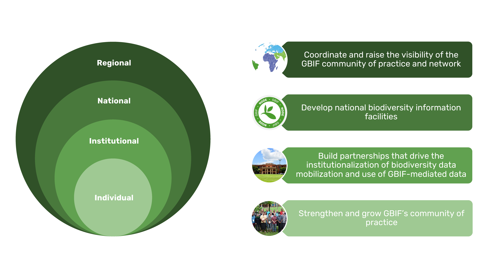

[[implementation-levels]]
== Implementation levels and progress monitoring

Capacity development actions are implemented on multiple levels in the GBIF network and involve a broad community of individuals. https://www.wenger-trayner.com/introduction-to-communities-of-practice/[Communities of practice^] have been defined by sociologists Wegner and Trayner as _“groups of people who share a concern or passion for something they do and learn how to do it better as they interact regularly”_. This document will refer to the GBIF community of practice as an inclusive term for the many practitioners engaged in activities contributing to GBIF’s mission who collaborate and learn from each other, often through activities such as mentoring, training, translation, and promoting open biodiversity data. 

Capacity development actions can be led by volunteers in the community of practice, participating institutions, the Participant nodes, and  GBIF Secretariat, and are often implemented through partnerships bridging these groups. Capacity development is frequently combined with outreach and engagement work, contributing to expanding the GBIF network. This framework is, therefore, an essential component of GBIF’s evolving participation and engagement strategy. 

Evaluation is integral to capacity development, and should involve and inform all stakeholders in a transparent way to enable them to guide future action and fully benefit from progress. In addition to ongoing monitoring, all the capacity development approaches that GBIF employs will include plans for periodic evaluation, as well as their own set of delivery indicators to track progress towards achieving specific outcomes, enabling the results to inform planning of future implementation. These evaluation processes will be necessarily specific to the programmes or actions they target, their goals, and the stakeholders involved, and are therefore not described in detail in this document.

This framework describes overarching goals for capacity development on the main implementation levels that GBIF targets: the individual, institutional, national, and regional levels. It further outlines monitoring indicators associated with each capacity development level that can help track overall progress and guide further implementation. 

[[individual-level]]
=== Individual level capacity development

****
The goal is to strengthen and grow GBIF’s community of practice: individuals with the skills, knowledge, and motivation to share and reuse biodiversity data for research, conservation and sustainable development, and to support others participating in the community.
****

The GBIF community of practice has emerged from the global network of biodiversity practitioners driven by their willingness to collaborate, share knowledge, tools, and standards, and support each other in progressing towards the common goal of open biodiversity data contributing to research, nature conservation, and sustainable development. 

The GBIF Secretariat and Participant nodes have a role in supporting interactions within the community of practice and encouraging its development and growth. Key components of  this are ensuring that there are open opportunities and transparent processes for members of the community to contribute to GBIF’s capacity development actions on all scales; that collaboration is central in these approaches; and that contributions are made visible for appropriate recognition and attribution.

====
*Monitoring progress*

The community, comprising all individuals globally active in sharing and reusing data through GBIF and sharing their skills with others, is much larger than GBIF can feasibly track. The following metrics can help to demonstrate growth in the community in specific areas:

Tracking *participation in GBIF’s volunteer community*, comprising mentors, trainers, translators, reviewers and biodiversity open data ambassadors, will help track strong involvement from individuals in helping to expand our community of practice. 

GBIF tracks *participation in training courses*. This can include skills certification in the form of digital badges for some courses. Tracking the growth in individuals having participated in courses as well as those having attained formal certification are useful metrics to show skills development across the community.

As part of the literature tracking process, GBIF tracks the number and country affiliation of *authors involved in articles citing the use of GBIF-mediated data*. This metric is helpful in demonstrating the growth of individual and institutional capacity within the use of GBIF-mediated data in research, including the geographic distribution of the user community.

These metrics will be regularly reviewed in terms of overall growth, as well as geographic spread, to help guide capacity development into under-represented communities and areas.
====

[[institutional-level]]
=== Institutional level capacity development

****
The goal is to build partnerships that drive the institutionalization of biodiversity data mobilization and the appropriate use of GBIF-mediated data within a global network of institutions, including academia, natural history collections, research institutions, national government departments and agencies, non-governmental and inter-governmental organizations, among others. 
****

Data is published to GBIF through registered institutions, not directly from individuals. Individual researchers may publish datasets through the institutions with which they are affiliated, or via journals to which they contribute. Observations from individuals are submitted through networks registered as GBIF data publishers. An important focus of capacity development must therefore be at the institutional level, ensuring that organizations have the means and motivation to mobilize data.

Focusing on the institutional level is important, not only for scalability, but also in order to build persistent engagement and practices that span across multiple departments and individuals within the organization or agency.

A growing number of formal academic higher education programmes now encourage the mobilization and use of GBIF-mediated data - see for example https://www.nhm.uio.no/english/research/projects/biodata/[BioData^], https://www.gbif.org/article/6Oaud6tpLOAm8wQMGqkkSi/ecoed-cohesive-training-and-skill-development-for-ecosciences[ecoEd^] and https://www.gbif.org/article/aA0MjVddRiRFOX2SEs7mT/promoting-gbif-data-use-through-a-graduate-degree-programme-in-biodiversity-informatics[Benin international Masters in Biodiversity Informatics^]. Such examples demonstrate how capacity at the institutional level can cascade to developing the capacity of students to use and publish biodiversity data in the future.

====
*Monitoring progress*

Tracking growth in the number of institutions that are registered and endorsed as data publishers is relatively easy and can give an indication of growth in institutional capacity to mobilize data through GBIF.  It is much harder to track the institutionalization of data use. GBIF documents guiding examples of the use of GBIF-mediated data in academic teaching but could consider developing new mechanisms to track and evaluate this type of capacity, such as tracking the development of curricula that include content on data mobilization and use through GBIF. Better engagement with capacity development within academic institutions would be greatly valuable for achieving the goals of this framework, but is beyond the scope of what can be tracked at present.

The following metrics can help to demonstrate development of institutional capacity:

The number of *data publishing institutions with at least one dataset* is easily tracked in GBIF and helps show where there is capacity at the institutional level for data publishing, noting that in many cases, nodes are supporting this capacity, for example by hosting datasets on national platforms.

Monitoring the number of *institutions with affiliated authors of literature citing the use of GBIF-mediated data* will give some indication of where there is institutional capacity to use GBIF-mediated data.

These metrics will be regularly reviewed in terms of overall growth, as well as geographic spread, to help guide capacity development into under-represented communities and areas.
====

[[national-level]]
=== National level capacity development

****
The goal is to develop national biodiversity information facilities that provide the coordination and enabling environment for data publishing and use at the national level, and are the core of GBIF’s governance and participation model.
****

GBIF supports the development of national biodiversity information facilities as collaborative networks of people and institutions that collectively form infrastructure for delivering biodiversity information to relevant stakeholders. This work often begins with engagement and capacity development at the institutional level, with a view to working with institutional partners to encourage formal national Participation in GBIF and the https://docs.gbif.org/effective-nodes-guidance/1.0/en/[establishment of a Participant node^] through a participatory approach as a means to ensure government level awareness and support for biodiversity data mobilization and use through GBIF.

When formally joining GBIF through signature of the GBIF Memorandum of Understanding (MoU), countries agree to establish a Participant node - a team designated to coordinate a network of people and institutions that produce, manage and use biodiversity data, collectively building a national infrastructure for delivering biodiversity information. The allocation of resources to the node is the responsibility of the participating country and is independent of GBIF’s core budget. Nodes are supported by organizational arrangements and informatics solutions, and work to improve the availability and usefulness of biodiversity data for research, policy, and decision-making.
 
Nodes vary greatly across the network, with a range of different hosting institutions and contacts, scales of operation, and available budgets. Developing capacity at the node level, and continuing to lower the technical threshold for active participation in GBIF as global infrastructure, is critical for GBIF’s scalability. Nodes need to provide a stable foundation for data mobilization and use within the expanding network, and for the benefit of GBIF as a whole. To achieve this, nodes themselves need to have the capacity to perform the functions expected of them. 

====
*Monitoring progress*

Monitoring the fluctuation in the number of formal Participants in GBIF, as well as the establishment of new Participant nodes, helps inform the development of national capacity in the network. Maintaining active nodes and Participants is also a key focus for this framework. GBIF also provides a https://www.gbif.org/tool/6Y2SqK8XokHUqIFUn6TLxX/online-capacity-self-assessment-tool-for-national-biodiversity-information-facilities[capacity self assessment tool^] to support nodes in monitoring their own capacity development over time. 

GBIF monitors the *density of active data publishing institutions* across all countries/economies, regardless of their Participation status, which can help demonstrate where capacity development is contributing to greater engagement of institutions.

Tracking *demonstrated activity from national nodes* (monitored on an annual basis) in the following areas also helps to identify countries that may be at risk of disengagement due to low capacity or engagement:

* Participation of the node (or node staff) in key GBIF-related events and activities
* Timely endorsement of data publishers 
* Growth in the data publisher network endorsed by the node
* Number of listed node staff

These metrics will be regularly reviewed in terms of overall growth, as well as geographic spread, to help guide capacity development into under-represented communities and areas. The node-related indicators will be monitored together with the Nodes Steering Group to help target communications and actions aiming at developing node capacity.
====

[[regional-level]]
=== Regional level capacity development

****
The goal is to develop the capacity to coordinate and raise the visibility of the GBIF community of practice and network on the regional level so that it can expand engagement on all other levels, and ultimately support GBIF in engaging in the regional-level biodiversity agenda.
****

GBIF’s nodes committee established https://www.gbif.org/the-gbif-network[six regional sub-committees^] recognizing the importance of strengthening collaboration and exchange between nodes on the regional level. These regional groupings can reflect alignment in priorities and languages, and, in some cases, regional biodiversity policies or agendas and working culture and norms. On the practical level, regional meetings simplify engagement by reducing travel distances and time zone differences.

It is important to recognize that the regions vary greatly in terms of the density of data available and published through GBIF, the level of use of GBIF-mediated data, and the number of GBIF Participants. GBIF implements capacity programmes targeting under-represented regions that contribute to developing the capacity at all levels and engaging new GBIF Participants via a regional approach. It is also important to note that capacity varies greatly within regions, such that capacity development actions on the regional level can enable stronger nodes to support less experienced ones.

Distributed GBIF regional support teams provide capacity support on the regional level, working in close alignment with the Participant nodes and volunteers. These teams are made up of part-time contractors based in the regions they serve. They focus their efforts on providing support in countries where GBIF does not yet have Participant nodes. Their work covers engaging data holding institutions, supporting data publishing, developing skills and engagement within the community of practice and providing feedback to GBIF on regional capacity needs. They can also provide training and support to nodes within the region upon request. Their work is aligned with GBIF’s work programmes and recommendations provided by the GBIF regional representatives.

====
*Monitoring progress*

Maintaining a regional view on progress across this capacity development framework will help ensure that approaches can be tailored to address regional needs and priorities. GBIF will aggregate the metrics mentioned for the other capacity development levels to the regional level for this purpose. These regional views can then be discussed with the regional node representatives and regional support team to guide further capacity development.
====
